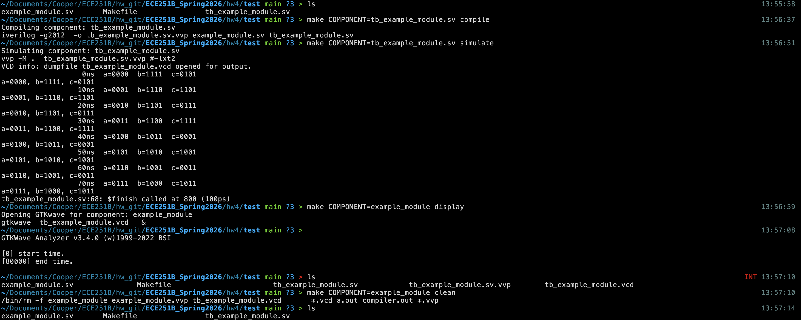

[← ../Computer_Architecture](../comp_arch)

## SystemVerilog on macOS & Makefile
_Last modified: {{ page.lastmod | date: "%b %d, %Y" }}_

### Icarus Verilog (iverilog):
This is your compiler for SystemVerilog. You can install it with [Homebrew](https://formulae.brew.sh/formula/icarus-verilog). \
**Make sure you have vvp.

### GTKwave:  
If you already tried installing it through Homebrew...

```
brew uninstall gtkwave
brew untap randomplum/gtkwave
brew install --HEAD randomplum/gtkwave/gtkwave
```

### Running the files:

First, you need to compile the file.
```
iverilog -g2012 -o simulation.vvp tb_example.sv example.sv
```
* -g2012 for SystemVerilog 2012 features
* -o to specify the output file

Then execute the file with:
```
vvp simulation.vvp
```

To view the waves:
```
gtkwave simulation.vcd
```

Note that to view the wave, you need to add dumpfiles and dumpvars in your testbench file. \
Also, as you might have noticed, this is not fun. So let's use a Makefile.

### Makefile:
First, create a file called `Makefile`. \
I recommend using [this](https://github.com/robmarano/verilog_project_template/tree/main).
A few things need to be changed:

```
simulate: $(COMPONENT).vvp 
@echo "Simulating component: $(COMPONENT)"
	$(SIMULATOR) $(SFLAGS) $(COMPONENT).vvp #$(SOUTPUT) 
```

Comment out the $(SOUTPUT) part. \
Also, I added `*.vvp` to my clean rule.

### Example:


→ to compile \
`make COMPONENT=tb_example_module.sv compile` 

→ to run \
`make COMPONENT=tb_example_module.sv simulate` 

→ to display (GTKwave) \
`make COMPONENT=example_module display` 

→ to clean \
`make COMPONENT=example_module clean` 

**Notice:** It is still not that great of a Makefile, but I don't know Makefiles well enough yet.
