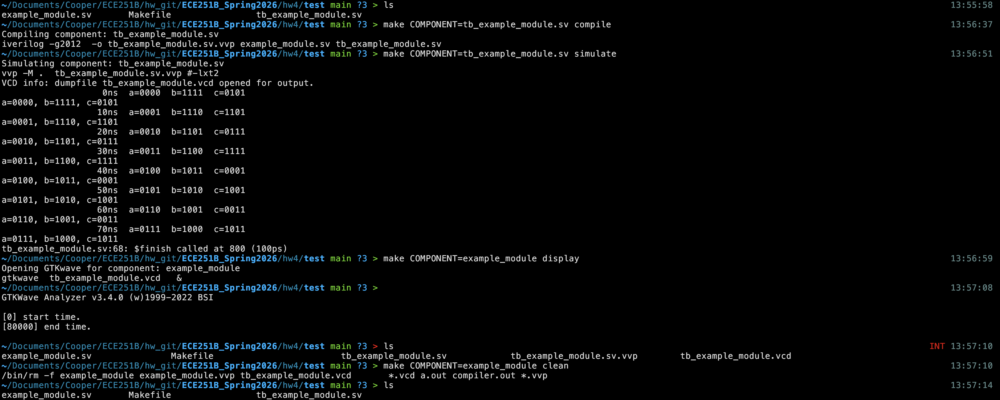

# Computer Architecture

## for macOS people....

### Icarus Verilog (iverilog):
just [homebrew](https://formulae.brew.sh/formula/icarus-verilog) this.

### gtkwave:  
`brew uninstall gtkwave`  
`brew untap randomplum/gtkwave`  
`brew install --HEAD randomplum/gtkwave/gtkwave`

### use makefile from here:
[https://github.com/robmarano/verilog_project_template/tree/main](https://github.com/robmarano/verilog_project_template/tree/main) \
few things that needed to be changed:

```
simulate: $(COMPONENT).vvp 
@echo "Simulating component: $(COMPONENT)"
	$(SIMULATOR) $(SFLAGS) $(COMPONENT).vvp #$(SOUTPUT) 
```

comment out the $(SOUTPUT) part \
Also I added `*.vvp` on my clean

### Example:


-> to compile \
`make COMPONENT=tb_example_module.sv compile` 

-> to run \
`make COMPONENT=tb_example_module.sv simulate` 

-> to display (GTKwave) \
`make COMPONENT=example_module display` 

-> to clean \
`make COMPONENT=example_module clean` 

** Notice how it is still not that great of a makefile.